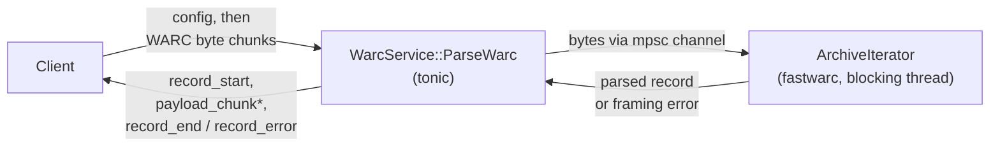

# fastwarc-grpc

Streaming gRPC server exposing the `fastwarc` WARC parser. Binary gRPC only
(no JSON transcoding); the protobuf contracts live in [`proto/`](proto) and
follow the buf Standard (`STANDARD` + `COMMENTS` lint categories). See
[DESIGN.md](DESIGN.md) for the architecture and the lossless data mapping.

This is a standalone companion project to
[chatnoir-resiliparse](https://github.com/chatnoir-eu/chatnoir-resiliparse).
The library itself is untouched and carries no gRPC dependencies. The server
sits directly on the `fastwarc` Rust crate; there is no Python or Cython in
the serving path.

## Architecture

`ParseWarc` is a bidirectional stream: the client uploads a `config` message
followed by raw archive bytes, and the server streams parsed records back as
it goes, without holding the whole archive in memory.



The archive bytes cross an `mpsc` channel into a `std::io::Read` adapter
feeding `ArchiveIterator` on a blocking task, so the synchronous, CPU/IO-bound
parser never blocks the async runtime. Parsed records flow back through a
second channel as a `ReceiverStream`, so the client sees each record as soon
as it is parsed rather than waiting for the whole archive. `ParseArchive`
(unary) runs the identical pipeline over a single request/response pair for
archives that fit comfortably in one gRPC message.

## Service

- `fastwarc.v1.WarcService/ParseWarc` (bidirectional streaming): send one
  `config` message, then raw archive bytes (`chunk`): plain, gzip, zstd, or
  lz4 (auto-detected when `stream_detect` is enabled, the default). Receive
  per kept record: `record_start` (full metadata, lossless header blocks),
  `payload_chunk`* (offset-tagged), `record_end` (payload length, digest
  verification results). HTTP-header failures on a framed record yield a
  recoverable `record_error`; WARC framing failures end the stream
  (non-recoverable).
- `fastwarc.v1.WarcService/ParseArchive` (unary): the whole archive in one
  request, every kept record (metadata, whole payload, digest statuses) in
  one response — for single records and small archives within the gRPC
  message size limits (4 MiB by default). Same parse pipeline, filters, and
  error model as the stream; a framing error returns the records parsed so
  far plus one non-recoverable error.
- `fastwarc.v1.WarcService/GetServiceInfo` (unary): service name, build
  version, and the `UiInfo` advertisement the shared ai-pipestream demo
  shell reads to build its tab bar.
- Filters matching Python `ArchiveIterator`: `record_types`,
  `min_content_length`, `max_content_length`, and `BuiltinFilter` predicates.
- `grpc.health.v1.Health` for load-balancer probes.
- gRPC server reflection (v1), so tools like `grpcurl` can discover and
  call the service without local copies of the proto files:

```sh
grpcurl -plaintext localhost:50060 describe fastwarc.v1.WarcService
grpcurl -plaintext \
  -d "{\"config\":{}, \"archive\":\"$(base64 -w0 record.warc)\"}" \
  localhost:50060 fastwarc.v1.WarcService/ParseArchive
```

### Python parity notes

| Local Python default | gRPC |
|---|---|
| `parse_http=True` | `parse_http` defaults **false** — set `true` for parity |
| `verify_digests` skips bad records | still emits; status on `record_end` |
| `func_filter=callable` | use `BuiltinFilter` or filter client-side |
| writing / fsspec / pickle | out of scope (local-only) |

## Build

Pure Rust: no native libraries, no vcpkg, no libclang.

```sh
cargo build
```

The server builds against the published
[`fastwarc`](https://crates.io/crates/fastwarc) crate; no checkout of
chatnoir-resiliparse and no fork-specific patches are required.

## Run

```sh
FASTWARC_GRPC_ADDR="[::]:50060" cargo run
```

The server shuts down gracefully on SIGINT or SIGTERM.

An example client streams a local archive and prints a per-record summary:

```sh
cargo run --example parse -- tests/data/warcfile.warc.gz
```

## Docker

```bash
docker build -t fastwarc-grpc .
docker run --rm --read-only --cap-drop ALL --security-opt no-new-privileges \
  -p 50060:50060 fastwarc-grpc
```

The build stage runs `cargo test --release` before compiling the release
binary, so a red suite fails the image rather than shipping one. `build.rs`
regenerates the protobuf stubs from `proto/` on every build (no checked-in
generated code), so the build stage is `dhi.io/rust:1-dev` with
`protobuf-compiler` installed via apt rather than the plain `dhi.io/rust:1`.
The runtime is `dhi.io/debian-base:trixie-debian13`: no package manager, no
shell, and it runs as a non-root user, which is why health checking is the
orchestrator's job over `grpc.health.v1.Health/Check` rather than a
Dockerfile `HEALTHCHECK`. `FASTWARC_GRPC_ADDR` (default `0.0.0.0:50060`)
overrides the listen address at runtime.

The published image is multi-arch (`linux/amd64` + `linux/arm64`) at
[`docker.io/pipestreamai/fastwarc-grpc:latest`](https://hub.docker.com/r/pipestreamai/fastwarc-grpc):

```bash
docker pull pipestreamai/fastwarc-grpc:latest
docker run --rm -p 50060:50060 pipestreamai/fastwarc-grpc:latest
```

## Lint and test gates

CI (`.github/workflows/ci.yml`) runs exactly these:

```sh
cd proto && buf lint && buf format --diff --exit-code
cargo fmt --check
cargo clippy --all-targets --no-deps -- -D warnings -D clippy::pedantic
cargo test
RUSTDOCFLAGS="-D warnings" cargo doc --no-deps
```

The WARC fixtures under `tests/data/` are unmodified copies from the
chatnoir-resiliparse test corpus, so parity assertions run against the same
inputs the library itself is tested with. The one addition is
`warcfile.warc.zst`, a zstd re-compression of `warcfile.warc` covering the
zstd autodetection path (the upstream corpus has no plain zstd archive).
